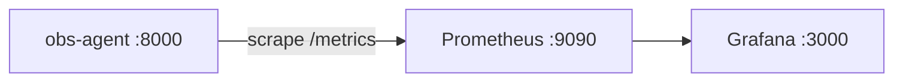

A simple observability agent to actively learn about containers and observability.

**Stack:** Python · FastAPI · Docker · Prometheus · Grafana  
**Post-Phase 1:** MCP server + LLM agent diagnosis loop

---

## Status

🔧 **Phase 1 — Step 5 (Docker Compose)** in progress.

- [x] Step 1 — Python environment setup with `uv`
- [x] Step 2 — FastAPI health-checker service
- [x] Step 3 — Dockerize the service
- [x] Step 4 — Push to GHCR
- [ ] Step 5 — Docker Compose with healthcheck **(current)**
- [ ] Step 6 — Add Prometheus `/metrics` endpoint
- [ ] Step 7 — Spin up Prometheus in Compose
- [ ] Step 8 — Grafana dashboard
- [ ] Step 9 — README polish

---

## Planned architecture



---

## Prerequisites

- Docker & Docker Compose

---

## Quickstart

```bash
docker compose up --build
```

| Service    | URL                          |
|------------|------------------------------|
| API docs   | http://localhost:8000/docs   |
| Prometheus | http://localhost:9090        |
| Grafana    | http://localhost:3000        |

---

## Endpoints

| Method | Path       | Description                                     |
|--------|------------|-------------------------------------------------|
| GET    | `/health`  | Health check — returns `{"status": "ok"}`       |
| GET    | `/check?url=<url>` | Probes a URL, returns status code + latency |
| GET    | `/metrics` | Prometheus metrics endpoint                     |

---

## Next Steps

- [ ] Prometheus metrics + custom `health_checks_total` counter
- [ ] Add Prometheus and Grafana services to `docker-compose.yml`
- [ ] Grafana dashboard with request rate (`rate()`) and p99 latency (`histogram_quantile()`)
- [ ] MCP server exposing PromQL as a tool for LLMs
- [ ] LLM agent loop for automated diagnosis
- [ ] Deploy to a cloud Kubernetes cluster (EKS/GKE/AKS free tier)
